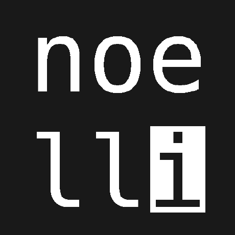

 
 
<h1 class="header center"></h1>
<h3 class="no-top-margin header center">{{ page.title | default: site.title | default: site.github.repository_name }}</h3>
 

    

        {{ page.description | default: site.description | default: site.github.project_tagline }}
    

    

        {{ page.kontakt | default: site.kontakt }} 
        <a class="icon-large" target="_blank" href="mailto:{{ site.email }}"><i class="fa fa-envelope green-text" style=""></i></a>
    

    <h5>Sprachen / Frameworks:</h5>

    <a class="btn btn-flat waves-effect waves-light waves-green icon-large tooltipped" data-position="top" data-tooltip="python.org" href="https://python.org">
        <i class="fab fa-python"></i>
    </a>
    
    
    
    <a class="btn btn-flat waves-effect waves-light waves-green icon-large tooltipped" data-position="top" data-tooltip="nginx.org" href="https://nginx.org">
        NGINX
    </a>

    <h5>Letzte Projekte:</h5>

 